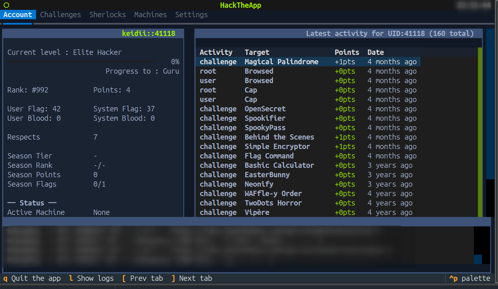
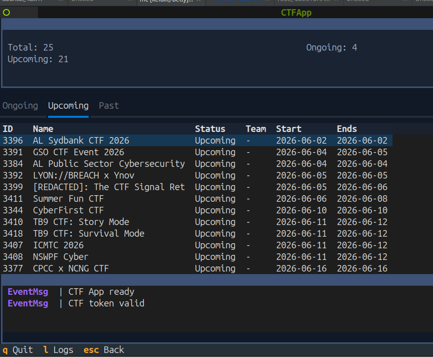

# htbConsole

Terminal UI for [Hack The Box](https://www.hackthebox.com/) platform and CTF competitions.

Built with [Textual](https://textual.textualize.io/) (Python TUI framework).

Inspired by [HTBtui](https://github.com/its-sarin/HTBtui).

## Screenshots

### HTB Platform


### CTF Platform


## Features

### HTB Platform (`tuiHTB`)

- **Challenges** — browse, filter by category/difficulty, infinite scroll pagination, start/stop containers, submit flags, download & auto-extract task files, community writeups (lazy loaded), per-challenge notes
- **Machines** — current, retired, seasonal lists with infinite scroll, machine details with start/stop/reset/submit, VPN status, per-machine notes
- **Sherlocks** — DFIR/SOC investigation tasks, filter by category/difficulty/state, split task view with description/hints/answer submission, incident file downloads
- **Player Profile** — stats, rank progress, activity feed with incremental loading, active machine & VPN status
- **Settings** — API cache toggle, Burp proxy toggle, workdir path, zip password, custom unpack command, terminal emulator config

### CTF Platform (`tuiCTF`)

- **CTF List** — ongoing (with join/play status), upcoming, past (lazy loaded with pagination)
- **CTF Context** — general info, categorized challenge browser with detail panel, notes per task, file downloads with auto-extract, ranking board, live scoreboard
- **Workspace Management** — auto-create directory trees per CTF (`{workdir}/CTF_{date}__{id}/{category}/{taskid}__{name}`)


## Install

```bash
# From PyPI (once published)
pip install htbconsole

# From source
git clone https://github.com/keidii/htbconsole
cd htbconsole
pip install .
```

### Development (editable, run in place)

```bash
python -m venv .venv
source .venv/bin/activate
pip install -e .       # or: pip install -r requirements.txt
```


## Configuration

Export your API tokens before launching:

```bash
export HTB_TOKEN="your-htb-api-token"
export CTF_TOKEN="your-ctf-api-token"
```

Get your HTB token from: [https://app.hackthebox.com/account-settings](https://app.hackthebox.com/account-settings) (App Token)

Get your CTF token from: https://ctf.hackthebox.com (inspect requests after login)

Optional environment variables:

| Variable | Default | Description |
|---|---|---|
| `HTB_TOKEN` | — | HackTheBox platform API token |
| `CTF_TOKEN` | — | CTF platform API token |
| `HTB_WORKDIR` | `./work` | Directory for downloads, notes, and task files |
| `USE_BURP` | — | Proxy address for Burp (e.g. `http://127.0.0.1:8080`) |
| `HTB_SETTINGS` | — | Explicit path to the settings YAML file |

Settings file resolution order: `HTB_SETTINGS` → `./htbSettings.yaml` if it already exists (back-compat) → `$XDG_CONFIG_HOME/htbconsole/htbSettings.yaml` (default `~/.config/htbconsole/htbSettings.yaml`).

## Usage

```bash
# Installed console commands
htbconsole            # prompts: [h]tb or [c]tf ?
htbconsole htb        # launch HTB platform TUI
htbconsole ctf        # launch CTF platform TUI
tui-htb               # launch HTB platform TUI directly
tui-ctf               # launch CTF platform TUI directly

# Standalone (no install needed, from repo root)
python -m htbconsole [htb|ctf]
python htbConsole.py [htb|ctf]
```

## Keybindings

| Key | Action |
|---|---|
| `q` | Quit |
| `l` | Toggle log console |
| `[` / `]` | Previous / next tab |
| `f` | Filter (challenges, sherlocks) |
| `Escape` | Focus list / go back |
| `Ctrl+S` | Save notes |


## License

MIT
